# Circuit Breaker — Architecture Diagrams

---

## 1. High-Level Component Overview

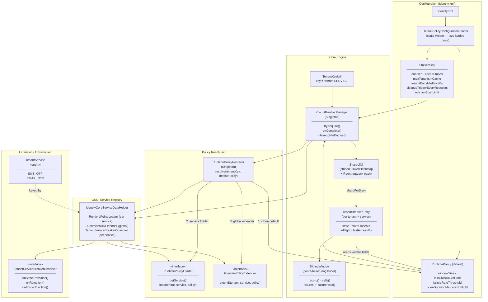

---

## 2. How a Service Uses the Circuit Breaker

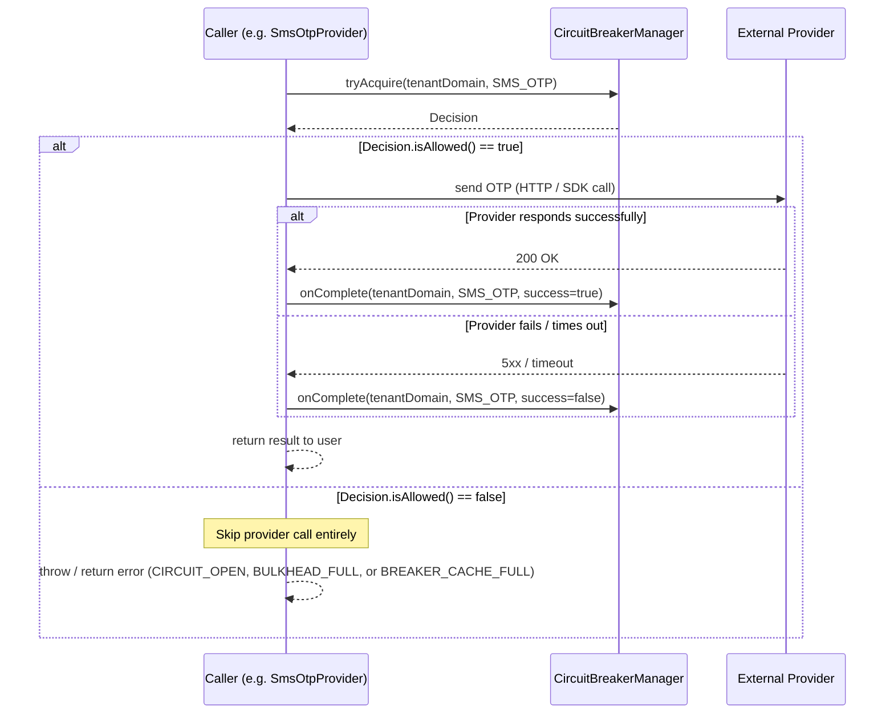

> **Key contract:** Every allowed `tryAcquire` MUST be paired with exactly one `onComplete`.
> The circuit breaker tracks in-flight concurrency via the bulkhead; leaking a call skews the count permanently.

---

## 3. Policy Loading — Static and Runtime

### 3a. Startup: Loading Defaults from identity.xml

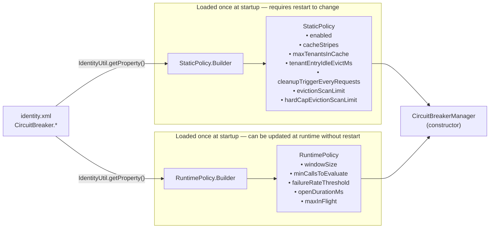

### 3b. Per-Entry: Runtime Policy Resolution Chain

Called once when a new `TenantBreakerEntry` is created (first request for a tenant × service pair).

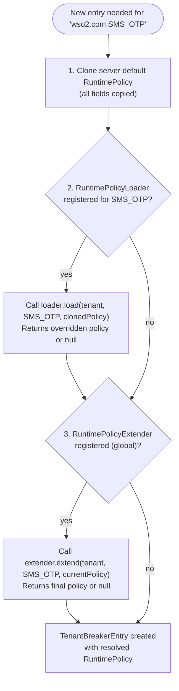

> **Precedence:** `RuntimePolicyExtender` always runs last and wins over `RuntimePolicyLoader`.
> Returning `null` from either hook keeps the current policy unchanged.

---

## 4. Observer Loading and Event Dispatch

### 4a. OSGi Registration (startup)

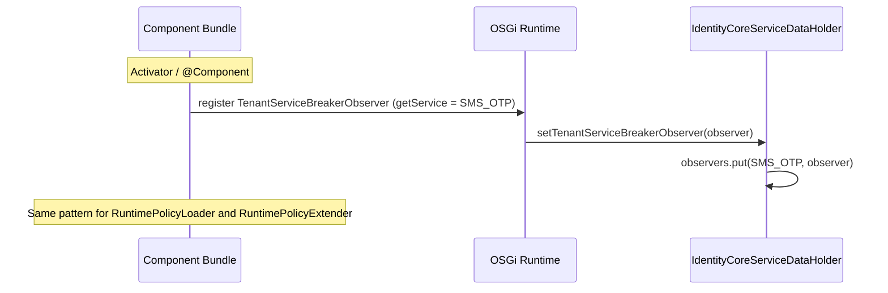

### 4b. Event Dispatch During Request Lifecycle

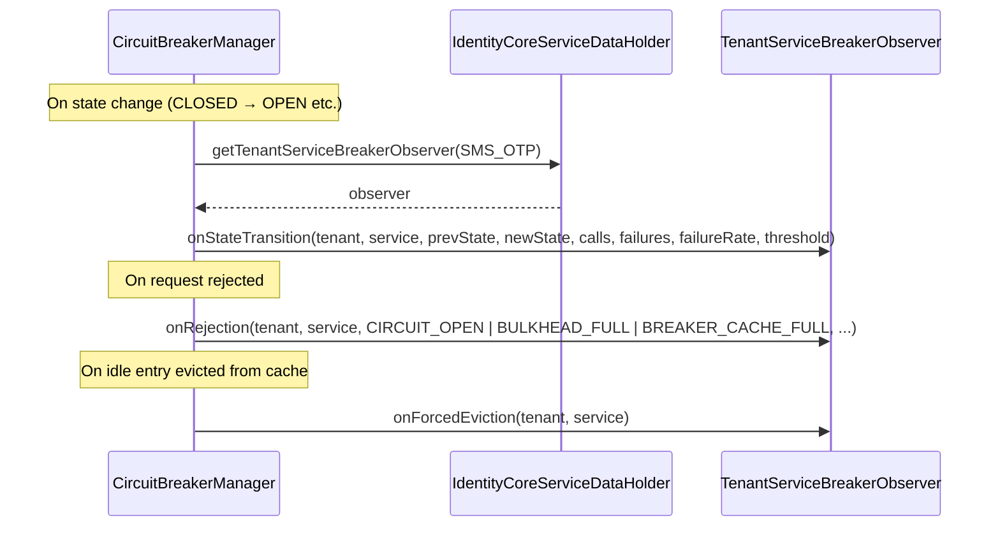

---

## 5. Circuit Breaker Internal Flows

### 5a. State Machine

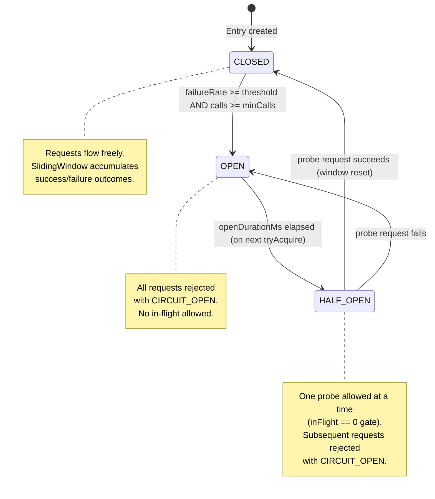

---

### 5b. `tryAcquire()` Flow

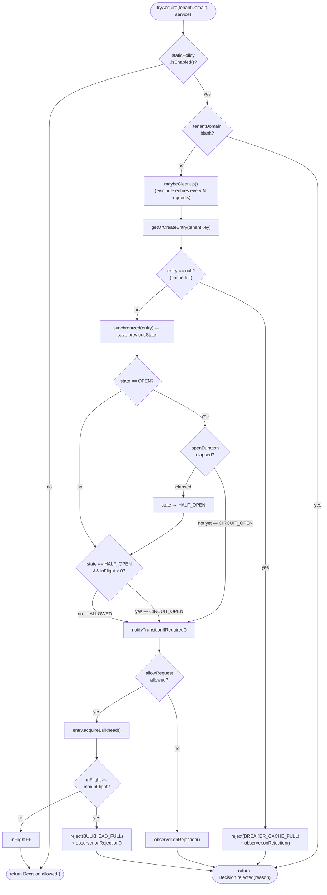

---

### 5c. `onComplete()` Flow

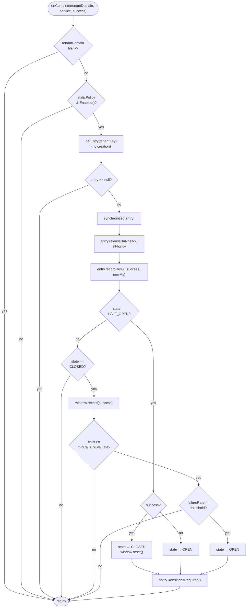

---

### 5d. Sliding Window (Count-Based Ring Buffer)

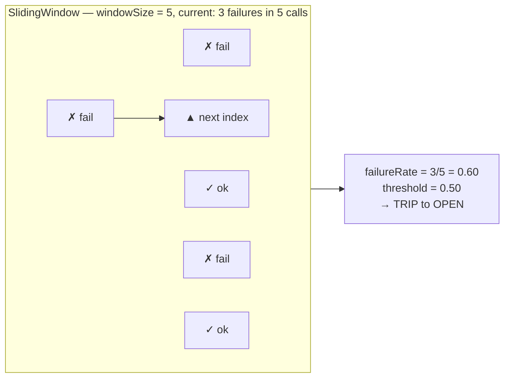

> The window is a fixed-size `byte[]` ring buffer. When full, the oldest outcome is overwritten and its failure/success contribution is subtracted before adding the new one. `reset()` clears the window on `HALF_OPEN → CLOSED` transition.

---

### 5e. `maybeCleanup()` Flow

Called on every `tryAcquire` to periodically trigger idle-entry eviction without a dedicated background thread.

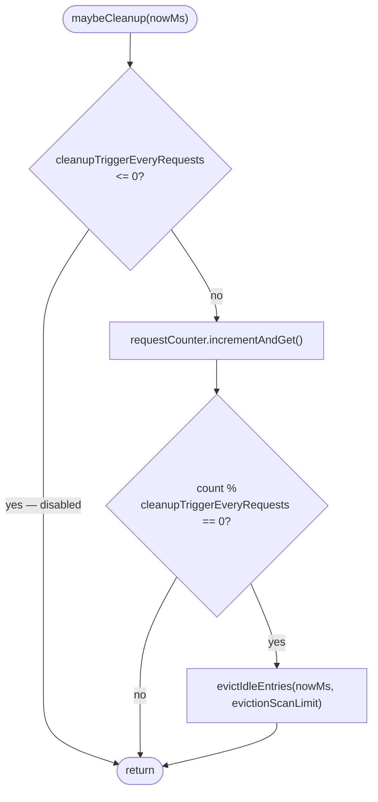

---

### 5f. `evictIdleEntries()` Flow

Scans up to `scanLimit` entries across shards in rotating order and removes any that have been idle longer than `tenantEntryIdleEvictMs` and have no in-flight requests.

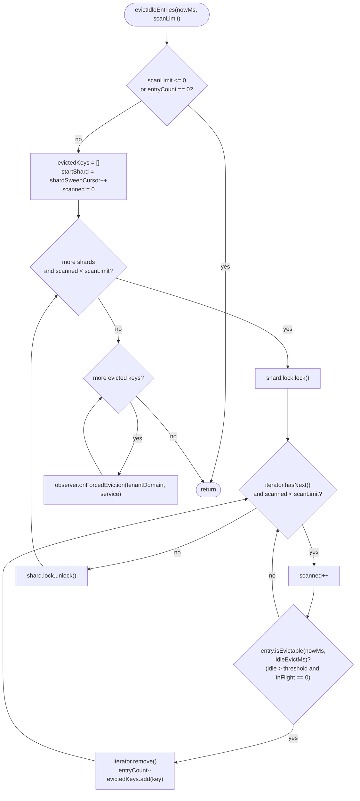

> Observer notifications are fired **after all shard locks are released** — evicted keys are collected inside the locked section and dispatched in a separate pass to avoid holding the lock during observer callbacks.

---

### 5g. `getOrCreateEntry()` + `ensureCapacity()` + `putIfAbsentEntry()` Flow

Called from `tryAcquire` to look up or create the `TenantBreakerEntry` for a tenant × service pair. Uses a double-checked lock pattern to minimise contention on the common (entry already exists) path.

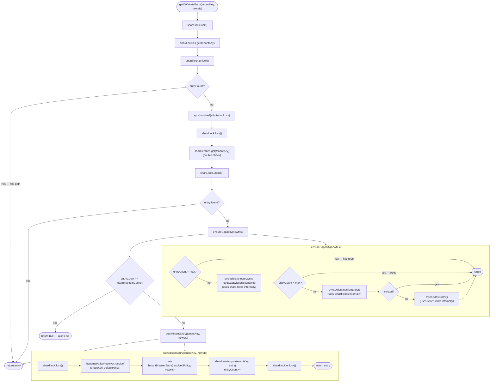

---

### 5h. `evictOldestInactiveEntry()` and `evictOldestEntry()` Flow

Both methods share the same internal chain — `findShardEldestCandidate` → `evictCandidate` → `removeEntry` — differing only in the `inactiveOnly` flag.

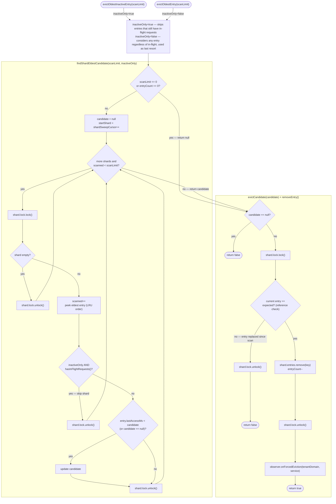

> The reference check inside `removeEntry` (`current entry == expected`) guards against a race where the same shard entry was replaced between the scan and the removal — in that case eviction is safely skipped.

---

## Summary: Component Responsibilities

| Component | Role |
|---|---|
| `CircuitBreakerManager` | Singleton entry point; shard routing; eviction; observer dispatch |
| `TenantBreakerEntry` | Per-tenant-service state: CLOSED/OPEN/HALF_OPEN, bulkhead counter, sliding window |
| `SlidingWindow` | Tracks last N outcomes to compute failure rate |
| `StaticPolicy` | Immutable cache/infrastructure settings from `identity.xml` |
| `RuntimePolicy` | Mutable breaker-behavior thresholds; volatile fields for live updates |
| `DefaultPolicyConfigurationLoader` | Reads `identity.xml` once via lazy Holder; produces both policies |
| `RuntimePolicyResolver` | Applies loader → extender chain to produce per-entry policy |
| `RuntimePolicyLoader` | OSGi extension point: override policy per service at entry creation time |
| `RuntimePolicyExtender` | OSGi extension point: global final override after service-level loader |
| `TenantServiceBreakerObserver` | OSGi extension point: react to state transitions, rejections, evictions |
| `TenantKeyUtil` | Builds/parses composite key `"tenantDomain:SERVICE"` |
| `TenantService` | Enum of supported services (`SMS_OTP`, `EMAIL_OTP`) |
